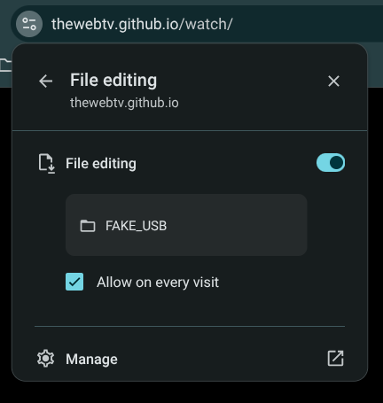

# FAQ
## Why can't I mount my USB drives?
Mounting USB devices is only supported on Chrome.

## Where can I find my USB drives?
USB devices can be found by clicking on the "HDMI" app tile.

## How do I mount my USB drives?
You can only mount your USB devices if you're using Linux. Open the app menu and click "HDMI". You'll be prompted to select a folder. Navigate to `/media` and select your folder. Any USB **mass storage device** that is plugged in should show up on most distros. **PTP and MTP have not been tested.**

On Windows and chromeOS, you won't be able to mount your USB devices. Instead, mount another folder on your computer, and create subfolders inside of there (which will show up as USB drives).

## Why aren't my USB drives showing up anymore?
> [!NOTE]
> This tip is only for people using Chrome.

First, click on the padlock icon in the URL bar, and scroll down until you see a "File Editing" button. Click on it and make sure the "Allow on every visit" box is checked. Then, clear the site data and refresh the page. You'll need to set up your system again, but it should be able to recognize your USB devices from that point on.

## Why is the cover art on a song grey?
This is either because the song doesn't have any cover art, or is using an unsupported metadata format.

* As of 29 May 2025, we can only read MP3 files that use ID3v2.3.0 or newer to encode metadata.
* We currently don't support pulling the image from M4A or other iTunes-purchased files.
* The parser might not be able to locate extra ID3 metadata (make sure it's at the very beginning of the file).

## Why is the cover art black?
This is a known artifact that happens in rare cases, which is most likely caused by metadata corruption or parsing errors.

## Will the USB audio player ever support ID3v2.0.0 metadata?
Yes, we plan to support ID3v2.0.0 in the future.

## Why does M4A audio take so long to load?
Our M4A metadata parser isn't optimized. But don't worry - we're working on a new, more optimized version of the M4A parser that not only will use less resources, but also run faster, be able to parse more files, accurately extract metadata, and support foreign alphabets, such as Cryllic, Hangul, or Kana.

## What file formats can be read from USB devices?
You can play .mp3, .m4a, .wav, and .aac audio files, and .mp4, .mov, .m4v, and .webm videos. In addition, plain-text file viewing is supported, and PNG, JPEG, and GIF images are also supported.

## How does live TV work?
Live TV works by using HLS-based IPTV services to provide a constant video stream. We use streams directly from channels, or trusted third-parties and streaming apps, like Samsung TV, Tubi, Xumo, and Roku.

## What does ALG mean?
ALG refers to a connection with no audio, such as raw video in, or VGA.

> [!WARNING]
> Sometimes, Windows will display devices with audio output, like capture cards, as "ALG". This is a Windows glitch. We recommend using Chrome on Linux. It works especially well on chromeOS (wonder why?) or Raspberry Pi OS.
